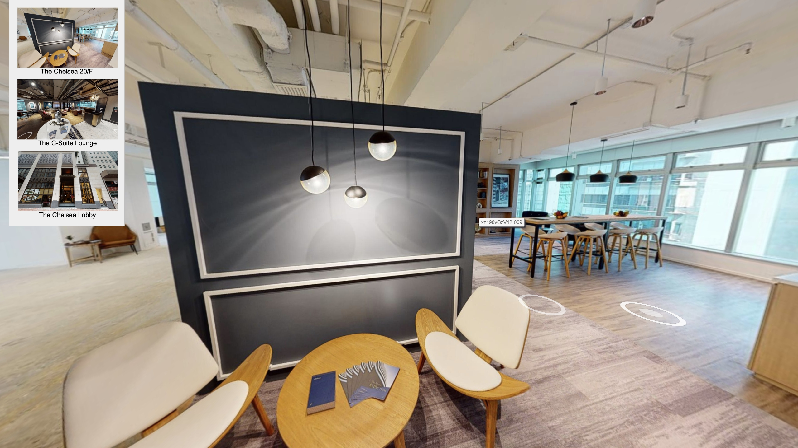
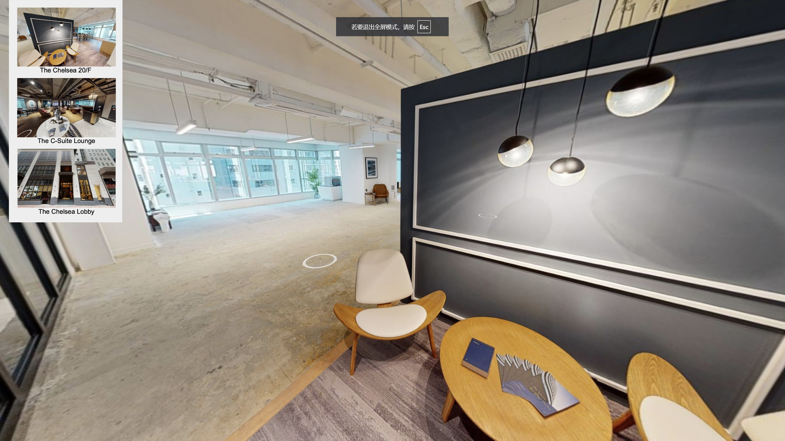
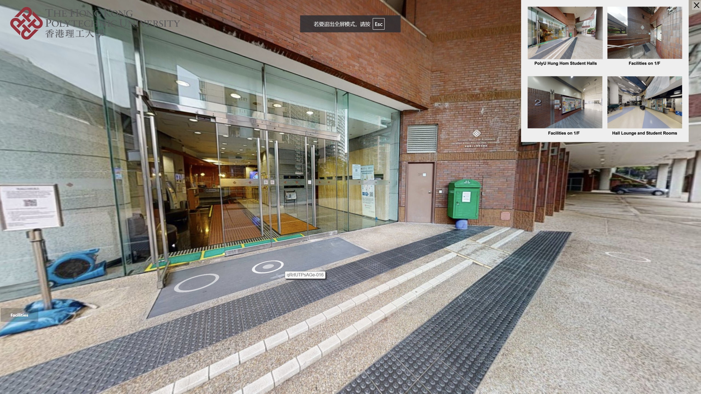
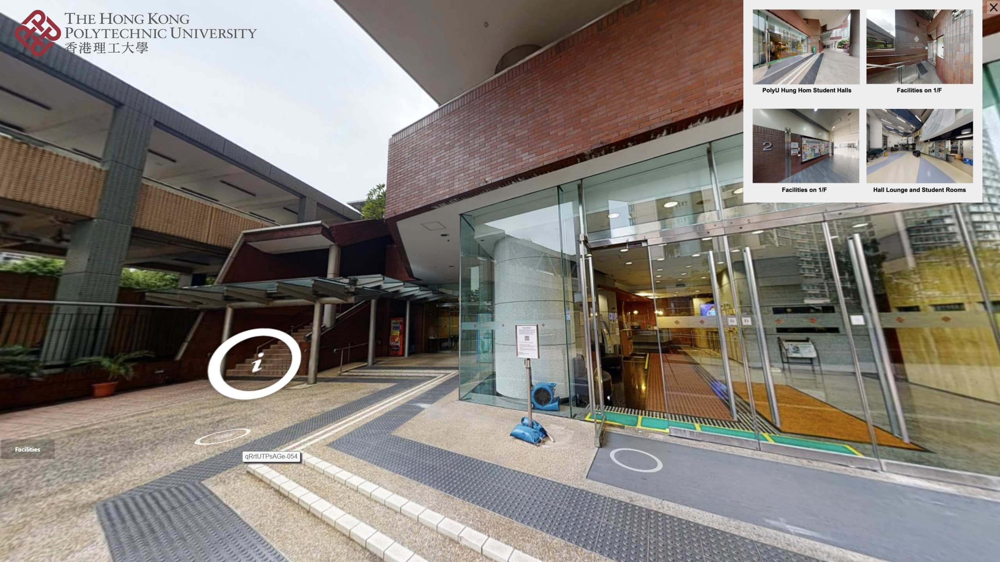
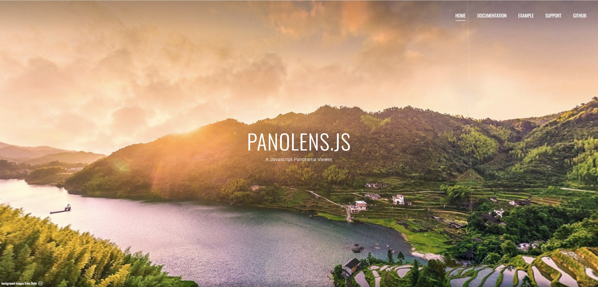

# ### Part 1: Imaging Technique Inspiration
Inspired by VR technology, a panorama is any wide-angle view or representation of a physical space, whether in painting, drawing, photography, film, seismic images, or 3D modeling.

In the project, we can use mouse dragging to 3D display the images of each side of the panoramic view, e.g.

### Part 2: Coding Technique Exploration
Panolens.js is based on Three.JS (a 3D framework) with specific interest area in panorama, virtual reality, and potentially augmented reality.

To create an image panorama, an equirectangular image (2 to 1 ratio e.g. width and height is 1024 x 512) is required. 

[Panolens Online](https://pchen66.github.io/Panolens/)
